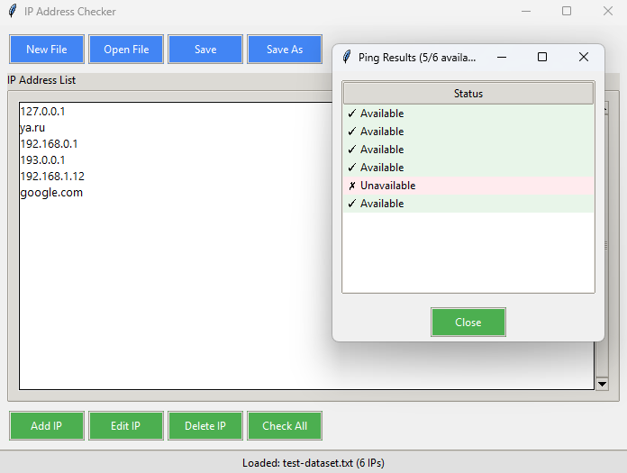

# IP Address Checker


Графическое приложение для проверки доступности IP-адресов с помощью ping-запросов. Позволяет управлять списками IP-адресов, проверять их статус и сохранять результаты.

 *(Пример скриншота приложения)*

## Возможности

- 📌 Загрузка и сохранение списков IP-адресов в файлы
- ➕ Добавление, редактирование и удаление IP-адресов
- 🚦 Проверка доступности всех адресов в списке
- 📊 Наглядное отображение результатов (доступен/недоступен)
- 🔄 Автоматическое определение ОС и подстройка параметров ping
- 🎨 Современный интерфейс с прогресс-баром

## Установка

1. Убедитесь, что у вас установлен Python 3.7 или новее
2. Клонируйте репозиторий:
   ```bash
   git clone https://github.com/ваш-username/ip-address-checker.git
   cd ip-address-checker
   ```
3. Запустите приложение:
    ```bash
    python ip_checker.py
    ```
## Использование
1. Создайте новый файл или откройте существующий со списком IP-адресов
2. Добавьте/удалите нужные IP-адреса
3. Нажмите "Check All" для проверки доступности
4. Просмотрите результаты в появившемся окне
5. Сохраните список для дальнейшего использования
## Поддерживаемые форматы
   - Текстовые файлы (.txt) с одним IP-адресом на строку
## Системные требования
   - Python 3.7+
   - Доступ к команде ping в системе
   - Разрешение на отправку ICMP-запросов
## Лицензия
Этот проект распространяется под лицензией MIT. См. файл LICENSE для подробной информации.

-----

Разработано с ❤️ для сетевых администраторов и IT-специалистов